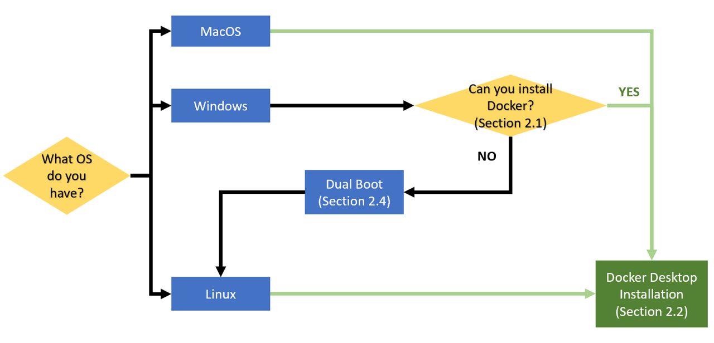

# Installation of dependencies: mk modules

## 1. What are mk modules?

[mk modules](https://github.com/elauksap/mk) bundle a set of scientific libraries compiled under the same toolchain. Once installed, they provide the command module, that has several subcommands:
- `module load <module name>`: loads the requested module. This creates a set of environment variables storing relevant paths for that library (e.g. `mkEigenPrefix`, `mkEigenInc`, ...). Use  `export | grep mk`  to obtain a list
- `module list`: shows a list of currently loaded modules
- `module avail`: shows a list of all available modules (loaded or not)
- `module --help`: shows a list of all the commands

## 2. Installation
Depending on the OS of your machine there are two different ways to install mk modules:
1. *Directly on your machine.* Possible only if you have a Linux distribution. This will offer the best performance when running your code.
2. *Using Docker Desktop.* Avaiable for Linux, MacOS and some versions of Windows. You will compile and run your code in a container. This option is more stable since it will not mess with your other toolchains.

In some cases it might be necessary or you might prefer to change your OS. For this scenario we suggest to consider a Dual Boot option (see Section 2.3).
The following flowchart should help you decide what is the best option for you.


### 2.1 Install natively on a Linux distribution
If you have a computer with a Linux operating system, you can install mk modules directly.

1. Download the [latest release](https://github.com/elauksap/mk/releases)
2. Extract it:
```bash
sudo tar xzvf mk-<version>.tar.gz -C /
```
3. To use the modules run `source /u/sw/etc/profile`. If you want to avoid typing it every time you open your terminal, modify your `~/.bashrc` file by adding
```bash
# mk.
export mkPrefix=/u/sw/
source ${mkPrefix}/etc/profile
module load gcc-glibc
# module load <module_name> for any other needed module
```

### 2.2 Install using Docker

For computers running on Linux or Mac, you can skip to Section 2.2.2.

#### 2.2.1 Windows
Since Docker relies on sharing a Linux kernel with its host you will lose some performances by running Docker on Windows. Moreover, Docker is avaiable on Windows only for the following versions:
* Windows 11 64-bit: Home or Pro version 21H2 or higher, or Enterprise or Education version 21H2 or higher.
* Windows 10 64-bit: Home or Pro 21H1 (build 19043) or higher, or Enterprise or Education 20H2 (build 19042) or higher.

To check you version press WINDOWS + R, enter `winver` and press OK. If your version is compatible with Docker you can decide to either use Docker (skip to Section 2.2.2) or use a dual boot (skip to Section 2.3). If you do not meet the requirements, you will need to use a dual boot (skip to Section 2.3).

#### 2.2.2 Installation
1. Install Docker following the instruction on the [official guide](https://docs.docker.com/get-docker/). Please read it thoroughly.
2. From a terminal with admin privileges pull the Docker image:
```bash
docker pull elauksap/mk
```
3. The image is just a snapshot of the state of a Linux OS, it is like a saving point from where you want to start. You can check your images with `docker image ls`.

4. To use your image you need to create a Docker container. To make a parallel with virtual machines, the Docker image is like the .iso of the OS, but then you have to install it. We want to create a container with the image we have just downloaded, give it a name (`--name hpc-courses-mk`) to remember its function and share a folder with the host so that we can exchange file easily (`-v /path/to/host/folder:/root/shared-folder`). The complete command is:
```bash
docker run --name hpc-courses-mk -v /path/to/host/folder:/root/shared-folder -it elauksap/mk
```
**WARNING:** to avoid problems `/path/to/host/folder` should not contain white spaces or special characters. For instance you can make your shared folder with the command `mkdir shared-folder` and than `/path/to/host/folder` would be `C:/Users/matteo/shared-folder` on Windows or `~/shared-folder` on Linux-like OS.

5. We can check our containers and their status with the command 
```bash
docker ps -a
```
6. Once you have created your container remember to **do not** use again the commad `run` but just `start` and `stop`. Otherwise you will create every time a new container. For instance to turn on the container and jump into it:
```bash
docker start hpc-courses-mk
docker exec -it hpc-courses-mk /bin/bash
```
7. Inside the container you can quit with `exit` and then stop the container with `docker stop hpc-courses-mk`.

8. If you want to remove a container you creaded for mistake you can run:
```bash
docker rm <name-of-the-container>
```

Always remember that documentation is your best friend! Do not panic, just type:
```bash
docker --help
```

### 2.3 Dual Boot
Dual-booting is the act of installing two operating systems on a single computer, and being able to choose which one to boot. You will need to install a Linux distribution, we suggest Ubuntu 20.04 LTS or 22.04 LTS. 

Before proceeding we suggest you to backup you data. To install a Dual Boot you can follow the [official guide](https://help.ubuntu.com/community/WindowsDualBoot) (which is a bit dated) or this [unofficial tutorial](https://itsfoss.com/install-ubuntu-1404-dual-boot-mode-windows-8-81-uefi/).

After you are done you can either install the mk modules natively (Section 2.1) or on Docker (Section 2.2).

## 3. Test the installation

1. Create a file `test-installation.cpp` with content:
```cpp
#include <Eigen/Eigen>
#include <iostream>

int main(int argc, char** argv)
  {
    std::cout << "Successfully included Eigen." << std::endl;
    return 0;
  }
```

2. Make sure the Eigen module is loaded: `module load eigen`

3. Compile and run the test:
```bash
g++ -I ${mkEigenInc} test-installation.cpp -o test-installation
./test-installation
```
